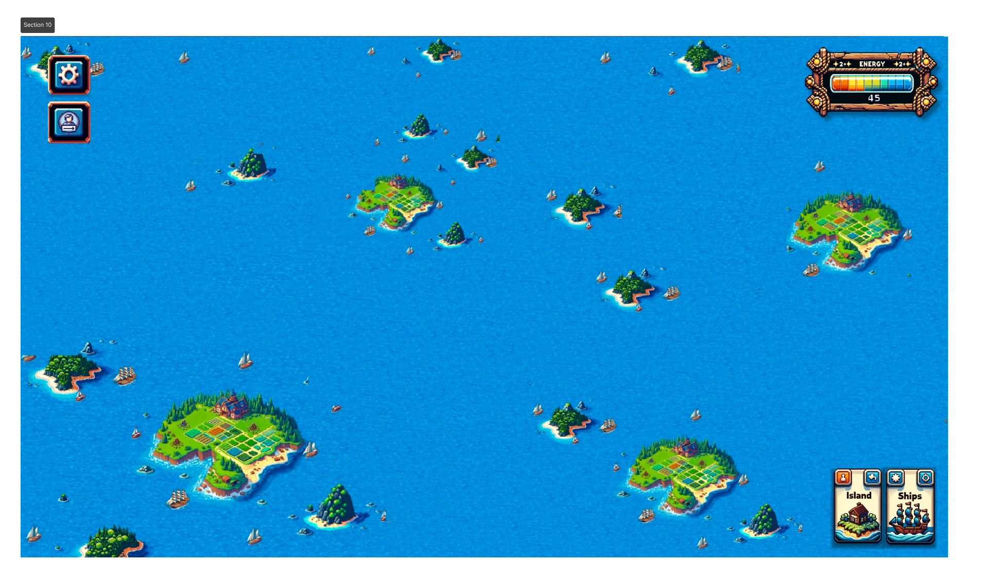

# 🌊 Infinite Seas PT Batch 0


**Game Brief:** _Infinite Seas_ is a **fully on-chain real-time** maritime trading and battling diplomatic MMO designed to maximize players' economic freedom by utilizing blockchain technology. Every in-game item, even data, is tradable on-chain.


## Overview

#### <mark style="color:orange;">**Welcome aboard to PT 1, Captain! ⛵️**</mark>

_**From our first playtest on Move (PT Batch 0) 💙:**_

_`Infinite Seas PT Batch 0 is the first playtest, where our team aims to gather feedback from 120 players within our community. This playtest is exclusively available to`_ [_`Game Character NFT holders.`_](fundamentals/game-characters.md)

#### <mark style="color:purple;">What's New for Playtest 1: 👶</mark>

Now, we're opening the seas to ✨**\~1,000 testers**✨! This time, it's on EVM. Yes, you read that right—we rewrote over 10,000 lines of smart contract code in Solidity in just two months! **Be proud—you’re part of a pioneering group shaping the future of Web3 gaming. 🥷**

We’re still in the early stages, and great games take many rounds of playtests to perfect. Thanks for joining us in this revolution of Web3 gaming. This game is different.&#x20;

To keep you engaged through this playtest journey, we’ve designed a **leaderboard** for internal game point accumulation. **Active players and testers will uncover hidden treasures, earning rare items and resources that will set you apart from the rest.**&#x20;

_(As @wighawag put it, "the best kind of retention is intrinsic.") <- and that’s exactly what we’re aiming to figure out through these playtests._

#### <mark style="color:red;">Keep In Mind, $Energy is the Capital  ⚡️ = 💰</mark>

* **Keep in mind that in order to thrive, manage your $Energy very carefully**:exclamation: :exclamation:&#x20;
* **Failure at managing your $Energy may cause you to lose the game at the very beginning**:exclamation::exclamation:&#x20;

<figure><figcaption>
Game map UI
</figcaption></figure>

### Game Website:&#x20;

* [https://game.infiniteseas.io](https://game.infiniteseas.io/faucet)

### _Twitter:_

* [_https://x.com/InfiniseasDev_](https://x.com/InfiniseasDev)

### Discord:&#x20;

* [https://discord.gg/X9wrNRqyq4](https://discord.gg/X9wrNRqyq4)

> ## Quick links


[1.-connect-your-wallet-and-name-your-island.md](product-guides/1.-connect-your-wallet-and-name-your-island.md)



[2.-get-token-from-our-faucet.md](product-guides/2.-get-token-from-our-faucet.md)


## Get Started
