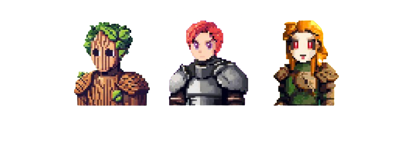

# 🤹 Game Characters

<figure><figcaption>
races: Wood, Ore, Seed
</figcaption></figure>

## **Dynamic NFT Overview (TBD)**

### **Dynamic NFT Characters:**

* Each Batch 0 playtester has a unique dynamic NFT character.
* The character evolves and unlocks new assets as you play the game and complete quests.

### **Unlockable Assets:**

* **Gameplay & Quests:** The more you engage, the more assets you unlock, including:
  * Armor
  * Backgrounds
  * Accessories
  * Skin tones
  * Hairstyles
* **Customization (Coming Soon):**
  * Soon, you’ll be able to customize your NFT’s appearance. All points are tracked from day 1 - the customization and dynamic NFT feature will be available soon.
  * **Unlocked Attributes:** Change your NFT’s look using the assets you’ve unlocked.
  * **In-Game Actions:** Specific in-game actions unlock specific attributes.
    * Example: Winning more battles unlocks advanced armor options.
