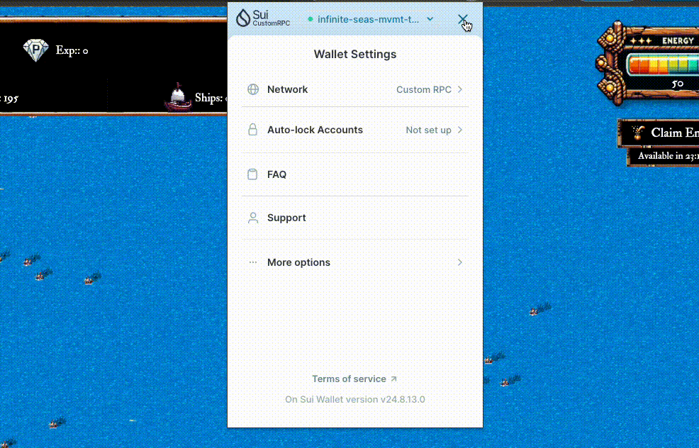

# 💲 1.  Connect Your Wallet & Name Your Island

### For SuiWallet Users:

* Make sure you use your whitelisted address or the address holds Batch 0 NFT
* Set the `Network` to `Custom RPC` : [https://devnet.baku.movementlabs.xyz](https://devnet.baku.movementlabs.xyz)
* if you are playing on the **Sui**, please <mark style="color:green;">**set the Network to Testnet**</mark> instead of the Custom RPC

<figure><figcaption>
Connect Wallet
</figcaption></figure>

### Name Your Island

After you connect your wallet, please name your account. The name you choose will be your island's name and will be displayed on the map and on the leaderboard. \

<figure><figcaption></figcaption></figure>
