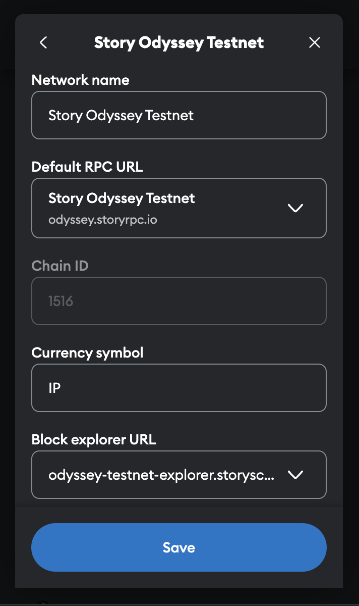

# 💲 1.  Connect Your Wallet & Name Your Island

### For SuiWallet Users:

* Make sure you use your whitelisted address or the address holds Batch 0 NFT
* Set the `Network` to `Custom RPC` in your wallet: [https://rpc.odyssey.storyrpc.io/](https://rpc.odyssey.storyrpc.io/)

<figure><figcaption>
More: <a href="https://docs.story.foundation/docs/story-network">https://docs.story.foundation/docs/story-network</a>
</figcaption></figure>

### Name Your Island

After you connect your wallet, please name your account. The name you choose will be your island's name and will be displayed on the map and on the leaderboard. \

<figure><figcaption></figcaption></figure>
