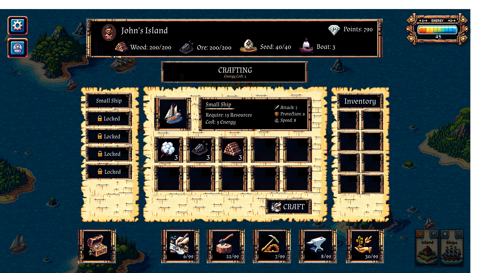

# ⛵ 5. Ship Crafting

<figure><figcaption>
Ship Crafting
</figcaption></figure>

Once you `Get` resources from the `Action Queue`, you can hit the Crafting button to start crafting.

### Crafting Recipe

At this stage, the only crafting recipe available is for a `small ship`, which requires a total of 15 resources, with a <mark style="color:green;">**minimum of 3 of each resource**</mark>.

### Adjusting Ingredients

* <mark style="color:red;">**Increase:**</mark> To increase the amount of a resource in the crafting table, click on the resource icon in the inventory on the right.
* <mark style="color:yellow;">**Decrease:**</mark> To reduce the amount of a resource in the crafting table, click on the resource icon in the crafting table.

As you adjust the ingredient amounts, you'll notice that the attributes of the output change:

* 1 normal wood = 1 defense
* 1 iron = 1 attack
* 1 cotton = 1 speed

### Start Crafting

When you finish adding the ingredients, hit "Craft" and enter the quantity you want to craft. This will cost $Energy and take a certain amount of time.
