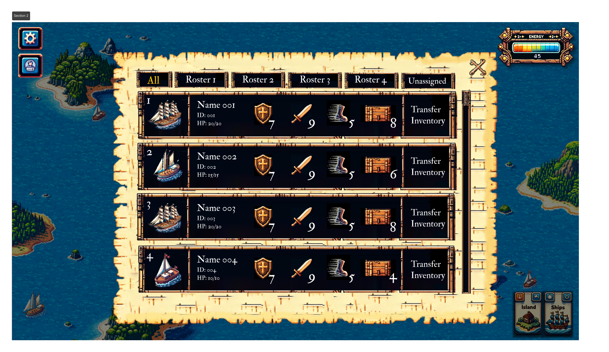

# 🔢 6. Ship Roster

<figure><figcaption>
Ship Roster
</figcaption></figure>

Once you have crafted a ship, you can see it directly near your island. To view its details, click on the `Ships` button in the bottom right corner.

### Sailing Your Ship

To set sail, you need to add your ships to a roster.

### Adjust Ship Roster

* **To Add:** To add a ship to a roster, first navigate to that roster. Then, click on the "+" at the bottom to select a ship from the unassigned group.
* **To Delete:** To delete a ship from the roster, click the "x" in the top right corner of that ship.
* **To Reorder:** To reorder ships in a roster, drag the ship to your desired position. In combat, the ships at the top of the roster will be attacked first.

We recommend adding 4 ships to a roster to increase your chances of winning.

