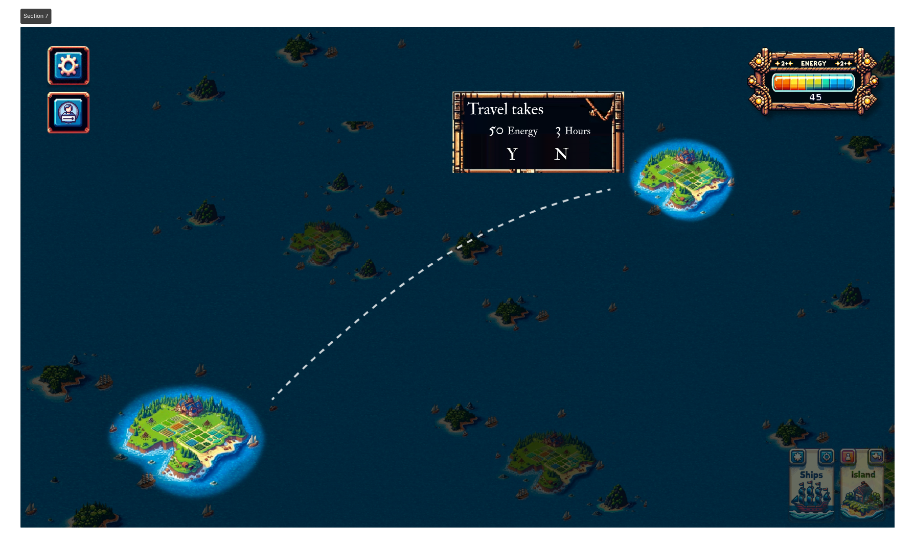

# ⚓ 7. Sailing

Once you are ready and confident with your roster, <mark style="color:blue;">**hit the**</mark><mark style="color:blue;">** **</mark><mark style="color:blue;">**`Sail`**</mark><mark style="color:blue;">** **</mark><mark style="color:blue;">**button**</mark> in the bottom right corner to start sailing.

After clicking on `Sail`, <mark style="color:orange;">**double-click your destination**</mark> on the map to begin your journey.

You can monitor the countdown timer by clicking on the `Island button` at the bottom.

<figure><figcaption>
sailing confirmation
</figcaption></figure>
