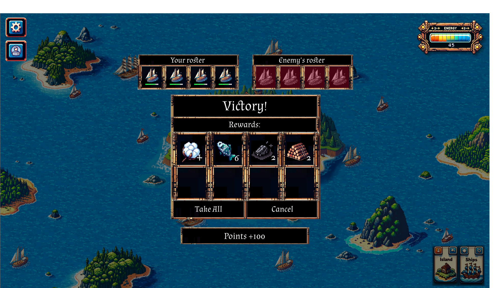
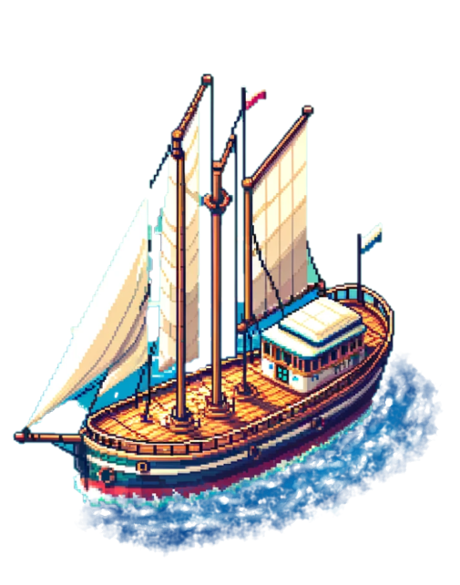

# 🎯 8. Ship Battle

<figure><figcaption>
Win a Combat
</figcaption></figure>

When your ship approaches another ship, whether it's controlled by the environment or another player, <mark style="color:yellow;">**a combat window will pop up**</mark>. If you click on Combat, the battle will automatically start and finish.

### <mark style="color:orange;">Win a Combat → Claim Loot</mark>

If you win a combat, click on the Combat History button in the top left corner to claim your loot.

### <mark style="color:purple;">Lose a Combat → Remove Dead Ships</mark>

If you lose a combat, click on the Combat History button in the top left corner to remove your dead ships.

<figure><figcaption></figcaption></figure>
